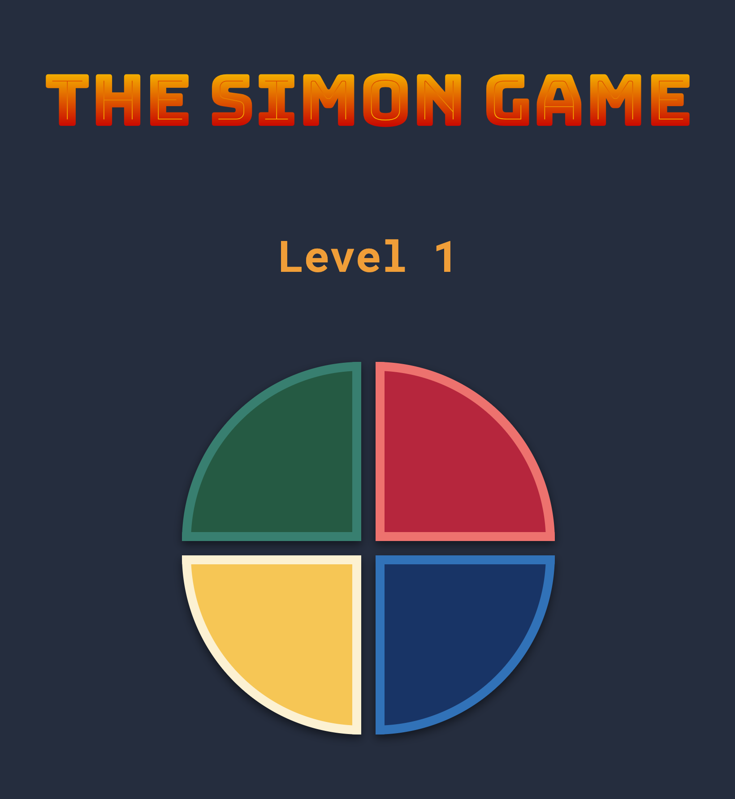

# The Simon Game

A game inspired by an electronic game Simon, which creates a series of tones and lights and requires a user to repeat the sequence.

This project was created during [The Complete Web Development Bootcamp](https://www.udemy.com/course/the-complete-web-development-bootcamp/) to practice using JavaScript library jQuery.
